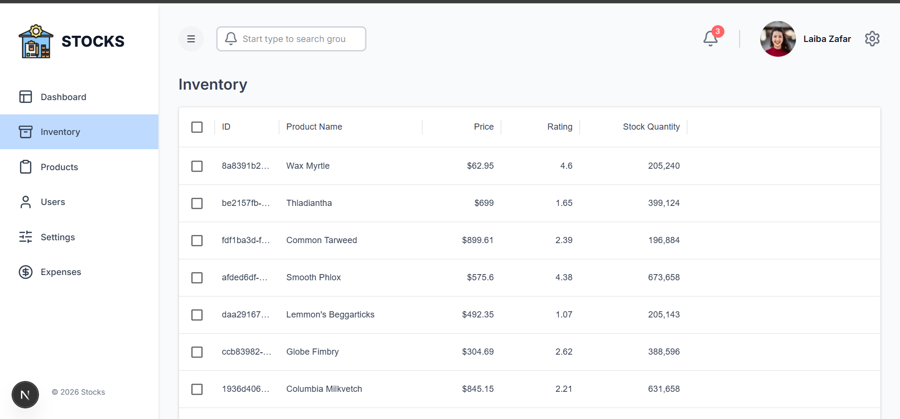
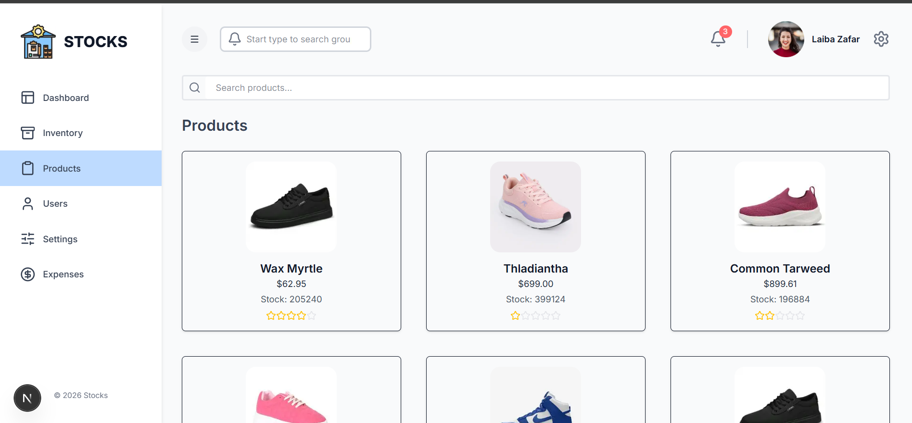
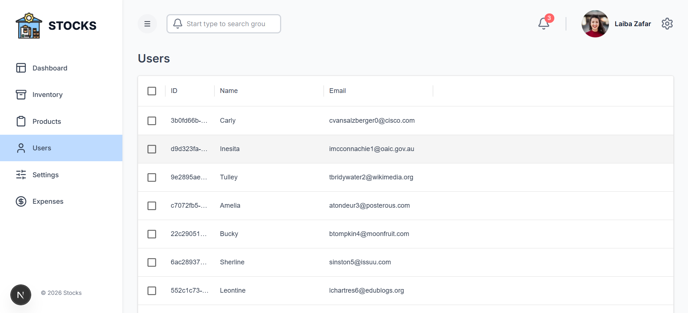
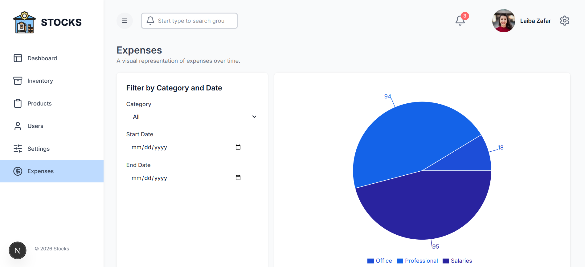

# Inventory Management Dashboard

A **full-stack inventory management dashboard** built with **Next.js, Redux Toolkit, Node.js, and Prisma**. This application allows you to manage products, categories, and inventory efficiently, featuring an intuitive dashboard with advanced data tables and CRUD operations.

---

## 🚀 Features

- **Dashboard Overview**  
  View total products, categories, and orders at a glance.
- **CRUD Operations**  
  Create, read, update, and delete products, categories, and inventory items.
- **Advanced Data Tables**  
  Built with **Material UI Data Grid** for sorting, filtering, and pagination.
- **State Management**  
  Uses **Redux Toolkit** and **RTK Query** for smooth frontend state and API management.
- **Authentication**  
  Secure login and signup functionality (optional: JWT-based authentication).
- **Responsive Design**  
  Built with **Tailwind CSS** for a modern and mobile-friendly UI.
- **Database Integration**  
  Powered by **Node.js** and **Prisma ORM** to interact with your database (PostgreSQL, MySQL, or SQLite).

---
## Screenshots

### Dashboard
.png)

### Inventory


### Products


### Users


### expense


---

## 🛠 Tech Stack

### Frontend
- **Next.js** - React framework for server-side rendering and routing  
- **Tailwind CSS** - Utility-first CSS framework for styling  
- **Material UI** - Data Grid & UI components  
- **Redux Toolkit & RTK Query** - State management and API fetching  
---
### Backend
- **Node.js & Express.js** - Server-side logic and APIs  
- **Prisma ORM** - Database modeling and queries  
- **Database** - PostgreSQL / MySQL / SQLite  

---

## 💻 Installation

### Clone the repository
```bash
git clone https://github.com/Laiba-Zafar7/inventory-dashboard.git
cd inventory-dashboard
```
---
### Install dependencies
## Backend
```bash
cd server
npm install
```
---

## Frontend
```bash
cd ../client
npm install
```
---

### Run the project
## Backend
```bash
cd server
npm run dev
```
---
## Frontend
```bash
cd ../client
npm run dev
```
---

#### Open your browser at http://localhost:5173
 
---
## Contributing

### Fork the project

### Create a branch:
```bash
git checkout -b feature-name

```
---
### Commit your changes:
```bash
git commit -m "Add feature"

```
---
### Push to the branch:
```bash
git push origin feature-name

```
---
#### Open a Pull Request

### License

#### This project is licensed under the MIT License.
